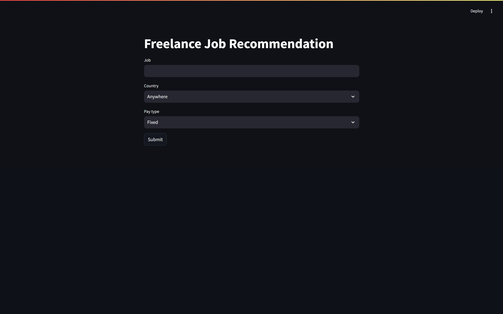
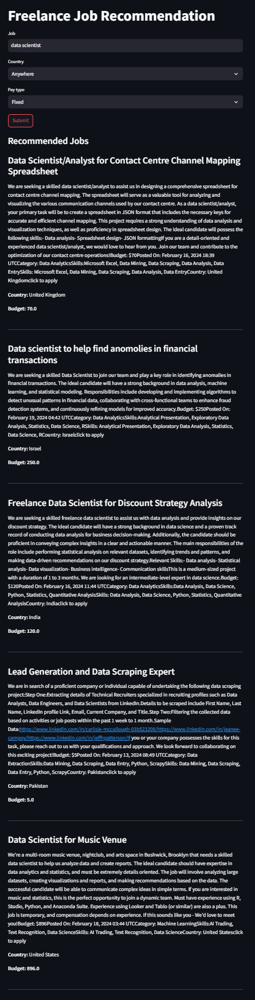

# 🧠 Freelance Job Recommender – NLP & Machine Learning

This project is an intelligent freelance job recommendation system powered by Natural Language Processing and Machine Learning. It analyzes user input (skills, preferences) and matches them with the most relevant freelance job postings.

---

## 🚀 What It Does

- Takes user input (keywords/skills)
- Cleans and vectorizes freelance job listings
- Recommends relevant jobs using an ML model
- Runs interactively via **Streamlit**

---

## 🛠️ Tech Stack

- **Python**
- **Pandas**, **NumPy**
- **Scikit-learn**
- **NLTK** for text preprocessing
- **TF-IDF Vectorizer**
- **Logistic Regression** (best performing model)
- **Streamlit** for web interface
- **Git LFS** to handle large `.csv` and `.pkl` files

---

## 📁 Project Structure

```

Freelance-Job-Recommender-NLP/
├── app.py                   # Streamlit web app
├── dataset.csv              # Freelance job dataset (\~69 MB, via Git LFS)
├── model.pkl                # Trained ML model (\~174 MB, via Git LFS)
├── notebook.ipynb           # EDA and model building
├── .gitignore               # Ignored files
├── .gitattributes           # Git LFS file tracking
├── screenshots/
│   ├── interface.png        # Streamlit interface preview
│   └── result.png           # Sample job recommendations
└── README.md                # This file

````

---

## 📊 Features

- Real-time job suggestions based on user input
- Streamlit UI: clean, interactive, beginner-friendly
- Model trained and evaluated using real job postings
- NLP pipeline includes tokenization, stopword removal, TF-IDF vectorization
- Logistic Regression model chosen for balance of accuracy and speed

---

## 🖼️ Screenshots

### 🔹 App Interface  


### 🔹 Recommendation Output  


---

## ▶️ How to Run Locally

```bash
# Clone the repository
git clone https://github.com/shefin01/Freelance-Job-Recommender-NLP.git
cd Freelance-Job-Recommender-NLP

# (Optional) Create virtual environment
python -m venv venv
venv\Scripts\activate  # For Windows

# Install dependencies
pip install -r requirements.txt

# Run the Streamlit app
streamlit run app.py
````

---

## 📦 Git LFS Note (Large Files)

This project uses **Git Large File Storage** (LFS) to manage the `.pkl` and `.csv` files. To clone with these files:

```bash
# If Git LFS isn't installed:
git lfs install

# Then clone the repo:
git clone https://github.com/shefin01/Freelance-Job-Recommender-NLP.git
```

---

## 👤 Author

**Mohammed Shefin**
[GitHub – shefin01](https://github.com/shefin01)

---

## 📝 License

This project is licensed under the [MIT License](https://opensource.org/licenses/MIT)

```

---
